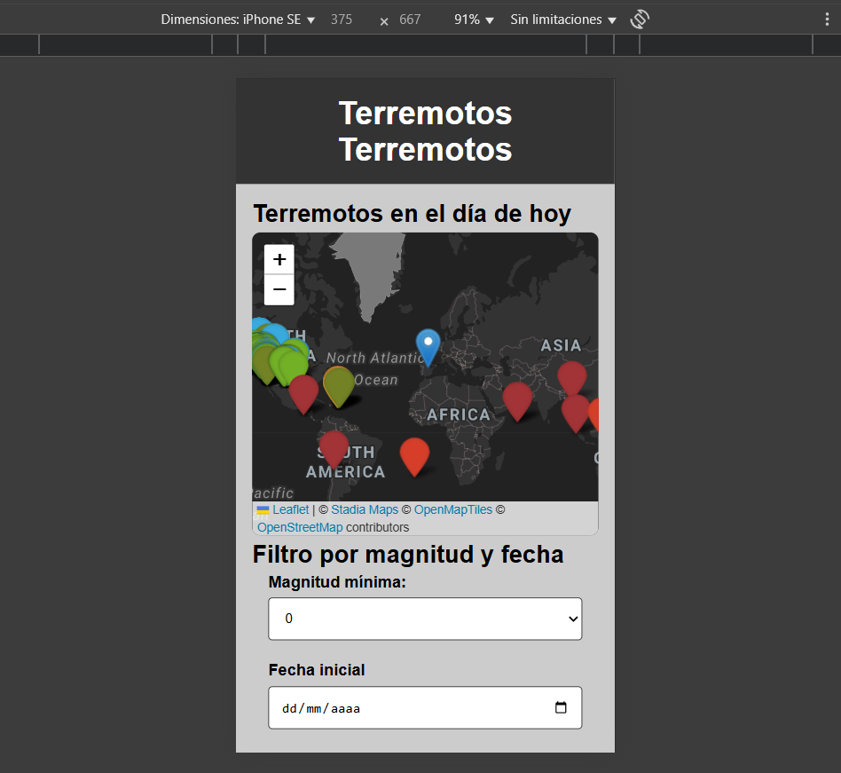

# 🌍 Visualizador de Terremotos con Leaflet

Este proyecto es una aplicación web interactiva que muestra terremotos en tiempo real y permite filtrarlos por magnitud y rango de fechas.
Utiliza datos abiertos de (https://earthquake.usgs.gov/) y está construido con **Leaflet.js**, JavaScript puro y diseño responsive **mobile-first**.

## 🧩 Tecnologías usadas

- HTML5
- CSS (Mobile First)
- JavaScript (Fetch API, DOM, Validación de formularios)
- Leaflet.js (mapas interactivos)
- Leaflet Awesome Markers (iconos personalizados)
- API GeoJSON de USGS

## 📱 Características

- 🌍 Mapa interactivo con marcadores de terremotos recientes
- 📅 Filtro por fecha de inicio, fecha final y magnitud mínima
- 🎨 Marcadores de colores según la magnitud del sismo
- 💡 Diseño responsive adaptable a móviles, tablets y escritorio
- 🧭 Estilo oscuro de mapas con Stadia Maps

## 📦 Estructura del proyecto
```
/Ejercicios_leaflet
│
├── assets 
├── images             
├── index.html # Estructura principal de la app
├── style.css # Estilos con diseño mobile first
├── script.js # Lógica JS y manejo del mapa y filtros
├── leaflet.awesome-markers.js
├── leaflet.awesome-markers.css
├── README.md
```
## 🚀 Cómo usarlo

1. Clona el repositorio o descarga los archivos.
2. Abre `index.html` en tu navegador.
3. Asegúrate de tener conexión a Internet (los mapas y datos se cargan de APIs externas).
4. ¡Explora los terremotos del mundo en tiempo real!

## 🛠 Requisitos

- Navegador moderno (Chrome, Firefox, Edge...)
- Conexión a Internet (para Leaflet, Stadia Maps y USGS)

## 💡 Próximas mejoras (ideas)

- Mostrar más datos en los popups (profundidad, tipo de evento)
- Exportar resultados filtrados a CSV o tabla
- Añadir paginación o agrupamiento de marcadores por región
- Soporte offline (con Service Workers)

## 👨‍💻 Autor

Miguel Ángel Jiménez Morante  
Desarrollador Web Full Stack  

## 📸 Capturas de pantalla

### Mapa de terremotos diarios


### Mapa de terremotos filtrados por fechas y magnitud


### Mapa de terremotos diarios responsive


